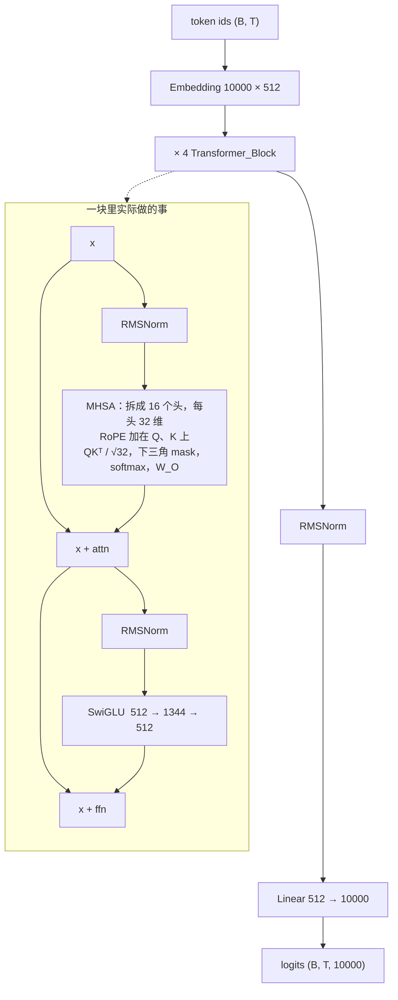
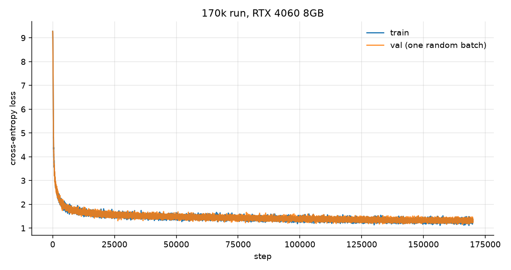

# miniGPT

从零实现的 Transformer 语言模型（约 22.7M 参数），在 TinyStories 上训练。分词、模型、优化器、训练循环都是手写的：不用 `nn.Transformer`，也不用 HuggingFace Trainer。

本仓库是斯坦福 CS336 Assignment 1 的个人实现，整理到可以训练和采样。**`src/` 核心代码手写；README 撰写和代码调试由 AI 辅助完成。** 它不是一个封装好的库。

## 关于实现（供学习）

下面这些是自己写的，对应文件可以直接读：

| 模块 | 文件 | 手写内容 |
|---|---|---|
| BPE 训练 | `src/my_bpe.py` | 预分词、pair 计数、merge、词表增长 |
| Tokenizer | `src/my_tokenizer.py` | encode / decode，特殊 token 保护 |
| 模型 | `src/my_model.py` | Linear、Embedding、RMSNorm、SwiGLU、RoPE、因果注意力、Transformer 块与 LM |
| 优化与损失 | `src/my_training.py` | AdamW、交叉熵、余弦学习率、梯度裁剪 |
| 训练循环 | `src/training_loop.py`、`train.py` | 组 batch、存盘、AMP 训练 |
| 采样 | `generate.py` | temperature、top-p、直到 `<\|endoftext\|>` |

**没有用的：** `nn.Linear` / `nn.Embedding` / `nn.Transformer` / `F.scaled_dot_product_attention` / HuggingFace `transformers`。矩阵乘用 `einops.einsum`，方便对照公式。

**用了框架、不算「手写算法」的部分：** PyTorch 的 `nn.Module`、自动求导、`torch.amp`、可选的 `torch.compile`。`src/pretokenization_example.py` 的 `find_chunk_boundaries` 来自课程材料。`src/my_training.py` 里的 `SGD` 是课程示例，不是我实现的。

读代码建议顺序：`my_bpe.py` → `my_tokenizer.py` → `my_model.py`（先 RMSNorm / Attention，再 Block）→ `my_training.py` → `train.py` → `generate.py`。

实现笔记（和代码对照着读）：

- [从零实现 BPE](docs/01-bpe-tokenizer.md)
- [Transformer 组件](docs/02-transformer-blocks.md)
- [训练踩坑与记录](docs/03-training-notes.md)

## 亮点

- **从零实现：** BPE、Embedding、带 RoPE 的因果多头注意力、SwiGLU、RMSNorm、AdamW、warmup + 余弦学习率、训练循环。
- **规模：** 22,696,448 参数（从 `checkpoint.pt` 统计）。4 层，`d_model=512`，16 头，`d_ff=1344`，上下文 256，词表 10,000。
- **硬件：** **RTX 4060 8GB**。CUDA 上开了混合精度（`torch.amp`）。
- **训练：** 170,000 step，batch 32，RTX 4060 8GB，**5.8 小时**。loss 从 9.27 降到约 **1.32**（全程曲线见下方）。
- **生成：** 可以写短儿童故事。原文见 [results/samples.md](results/samples.md)。

## 项目结构

```
miniGPT/
├── config.py                 # 模型 / 训练 / 路径默认值
├── train.py                  # 训练循环
├── generate.py               # 采样
├── prepare_data.py           # TinyStories 编码成 data/train_tokens.npy
├── verify_data.py            # 检查 token 数组
├── demo.md                   # 怎么跑生成、温度对比怎么看
├── plot_loss.py              # 从训练 log 画 loss 曲线
├── pyproject.toml            # torch, numpy, einops, regex, matplotlib
├── docs/                     # 实现笔记（BPE / 模型 / 训练）
├── results/
│   ├── loss_curve_170k.png   # 有日志的 170k 全程
│   ├── metrics_170k.csv
│   ├── loss_curve.png        # 更早的 3000 step 试跑
│   ├── metrics_3000.csv
│   ├── eval_170k.txt         # 旧 checkpoint.pt 的事后评估
│   └── samples.md            # 生成原文（来自 checkpoint.pt）
├── src/
│   ├── my_bpe.py             # BPE 训练
│   ├── my_tokenizer.py       # encode / decode
│   ├── my_model.py           # RMSNorm、SwiGLU、RoPE、注意力、LM
│   ├── my_training.py        # AdamW、交叉熵、余弦 LR、梯度裁剪
│   ├── training_loop.py      # batch 与 checkpoint
│   └── pretokenization_example.py
├── data/                     # 计划只提交词表；语料和 npy 不进 git
│   ├── vocab.pkl
│   ├── merges.pkl
│   ├── TinyStoriesV2-GPT4-train.txt
│   └── train_tokens.npy
├── checkpoint.pt             # 本地旧权重，约 260MB，不进 git
└── checkpoints/run170k.pt    # 这次有日志的 170k 权重
```

`train_bpe()` 在 `src/my_bpe.py` 里，还没有单独的命令行入口。词表是在 TinyStories 的 50MB 子集（`data/train_50m.txt`）上训的，再用 `prepare_data.py` 编码完整训练集。

## 快速开始

Python 3.12–3.13。本仓库用 [uv](https://github.com/astral-sh/uv)：

```bash
uv sync
```

**数据。** 把 TinyStories V2（GPT-4）训练集放到 `data/TinyStoriesV2-GPT4-train.txt`，并保留 `data/vocab.pkl` 和 `data/merges.pkl`。然后编码：

```bash
python prepare_data.py
```

**训练**（默认见 `config.py`：170k step，batch 32，适合 8GB 显存的 AMP）：

```bash
python train.py
```

**采样：**

```bash
python generate.py --prompt "Once upon a time" --temperature 0.8 --seed 42
```

`--temperature`、`--top_p`、`--max_new_tokens`、`--n_samples`、`--checkpoint`、`--seed` 都可以改。说明见 [demo.md](demo.md)。

如果当前目录已经有 `checkpoint.pt`，可以跳过训练，只跑 `generate.py`。

RTX 4060 8GB 上 170k step 的墙上时间：**5.8 小时**（20833 秒，见 `results/metrics_170k.csv` 最后一行）。

## 模型结构

整网是一个 decoder-only 的语言模型，代码在 `src/my_model.py`。前向就是：token id → 向量 → 重复 4 次同样的块 → 再归一化 → 投影回词表。

和常见 GPT-2 教程的差别：

- **位置：** 没有可学习的绝对位置 embedding。RoPE 加在每个头的 Q、K 上（`theta=10000`）。
- **归一化：** RMSNorm（除以均方根），不是 LayerNorm。块内是 pre-norm：先 norm 再进注意力 / MLP。
- **MLP：** SwiGLU，`silu(xW1) * (xW3)` 再乘 `W2`，不是 GELU 两层 MLP。
- **线性层：** 自己写的 `Linear` / `Embedding`，没有 bias。`lm_head` 没有和 embedding 绑权重。

一块里面两行残差，和 `Transformer_Block.forward` 一致：

```
x = x + Attention(RMSNorm(x))     # 16 头，因果 mask，RoPE
x = x + SwiGLU(RMSNorm(x))
```



注意力是手写的缩放点积：`QK^T / sqrt(d_k)`，未来位置填 `-inf`，再 softmax。`d_k = 512 / 16 = 32`。采样时序列超过 256 只保留末尾 256 个 id（RoPE 的 cache 也只建到这个长度）。

| | |
|---|---|
| 词表 | 10,000 |
| 上下文 T | 256 |
| 层数 | 4 |
| d_model | 512 |
| 头数 | 16 |
| d_k | 32 |
| d_ff | 1344 |
| RoPE θ | 10,000 |
| 参数量 | 22,696,448 |

参数量是从 checkpoint 的 `state_dict` 数出来的，不是估算。
## 训练结果

有日志的这一次：`checkpoints/run170k.pt`，`results/metrics_170k.csv`。RTX 4060 8GB，**5.8 小时**（20833 秒）。

| | |
|---|---|
| step 0 | train 9.275 / val 9.275 |
| 最后一点（step 169999） | train 1.328 / val 1.315 |
| 最后 1000 step 平均（100 个 log 点） | train **1.299** / val **1.319** |
| 乱猜基线 | `log(10000) ≈ 9.21` |

val 每个点仍是 **一个随机 batch**，所以曲线抖，但整体贴着 train 往下走，没有明显过拟合。



重画：`python plot_loss.py --from_csv results/metrics_170k.csv --out results/loss_curve_170k.png --title "170k run, RTX 4060 8GB"`

| | |
|---|---|
| GPU | RTX 4060 8GB |
| step | 170,000 |
| batch size | 32 |
| 上下文 | 256 |
| 每 step token 数 | 32 × 256 = 8,192 |
| 计划看过的 token 数 | 170,000 × 8,192 = 1,392,640,000 |
| 最大学习率 | 3e-4 |
| 最小学习率 | 3e-5（结束时已到） |
| warmup | 2,000 step |
| 学习率日程 | warmup 后余弦衰减 |
| AdamW | β = (0.9, 0.95)，wd = 0.1，eps = 1e-8 |
| 梯度裁剪 | 1.0 |
| AMP | CUDA autocast + GradScaler |
| train/val 划分 | `train_tokens.npy` 最后 10% 做验证 |
| 存盘间隔 | 每 500 step |
| 墙上时间 | 5.8 小时 |

更早还有一次没留 log 的 170k 权重 `checkpoint.pt`。事后 32-batch 评估 train 1.31 / val 1.32，见 [results/eval_170k.txt](results/eval_170k.txt)。生成样例是用那份旧权重跑的。3000 step 试跑曲线仍在 [results/loss_curve.png](results/loss_curve.png)。

## 生成样例

`generate.py` 默认：`top_p=0.9`，最多 250 个新 token，遇到 `<|endoftext|>` 停止。下面是 `checkpoint.pt`、`seed=42` 的**全文**（没有省略）。同一套记录也在 [results/samples.md](results/samples.md)。

Prompt：`Once upon a time`

**T = 0.6**

```
Once upon a time, there was a little girl named Lily. She loved to play with her toys and have fun with her friends. One day, Lily found a big box in her room. She was very excited and wanted to see what was inside.
Lily opened the box and found a pretty doll. She loved the doll very much and wanted to play with it. But the doll was not a toy, and it was a gift for her. Lily was sad and did not know what to do.
Lily's mom saw her sad face and asked what was wrong. Lily told her mom about the doll and the gift. Her mom smiled and said, "Don't worry, Lily. I will help you." Together, they opened the box and found a new doll inside. Lily was so happy and played with her new doll all day long.
<|endoftext|>
```

**T = 0.8**

```
Once upon a time, there was a little boy named Tim. Tim was a happy boy who loved to play with his toys. One day, Tim found a big box in his room. He was very excited to see what was inside.
Tim opened the box and found a funny hat. He put the hat on his head and started to dance. Suddenly, the hat started to talk! "Hello, Tim!" said the hat. Tim was very surprised. He did not know that the hat could talk.
The hat told Tim that it was a magic hat. It could make things happen if you put on a show. Tim was very excited. He put on a show for his friends, and they all danced and had fun. In the end, Tim's show was the best one ever.
<|endoftext|>
```

**T = 1.0**

```
Once upon a time, there was a little mouse named Tim. Tim was a happy mouse who loved to play with his friends. One day, Tim found a big piece of cheese. He was very excited and wanted to eat it all by himself.
Tim's friend, Sam the squirrel, saw the cheese too. Sam was a smart mouse who knew how to steal. So, Sam took the cheese and ran away. Tim was sad because he knew that steals was not good.
Tim saw his friend, the wise owl, sitting under a tree. Tim told the owl about the cheese. The owl said, "This cheese belongs to all the animals. We should share it." Tim learned that it is better to share and be kind to others. From that day on, Tim shared his cheese with all his friends, and they all played happily together.
<|endoftext|>
```

Prompt：`My name is Tom. I live in a beautiful place.`

**T = 0.6**

```
My name is Tom. I live in a beautiful place. I like to make friends."
Lily and Tom became friends. They played together every day. They liked to run, jump, and laugh. They were very happy.
One day, Lily and Tom found a big box. They did not know what was inside. They opened the box and found a lot of toys. They were so happy. They played with the toys all day long. The big box was their new favorite place to play.
<|endoftext|>
```

**T = 0.8**

```
My name is Tom. I live in a beautiful place. I like to make friends." The other animals were happy to meet Tom. They all played together and had a great time.
The moral of the story is to be kind and make friends with everyone.
<|endoftext|>
```

**T = 1.0**（250 个新 token 用完，没有遇到 `<|endoftext|>`）

```
My name is Tom. I live in a beautiful place. I have many things to make friends. Do you want to see my magic wand?" Anna says.
Tom likes magic. He laughs and thanks Anna.
"Thank you, Anna. Your magic is very nice. I want to see your flower. I want to see your flower. It is very pretty. Can you recommend something to it?" Tom says.
Anna thinks for a moment. She is curious. She likes her flower. She likes flowers. She wants to see Tom's flower.
"Tom, can you show me your flower? It is a very nice flower. It is very popular. We can be friends. Do you want to go to the garden with me?" Anna says.
Tom thinks for a moment. He likes Anna's answer. He does not know how to say hello. He feels scared. He thinks Anna is not always best. He thinks his flower is not nice.
"OK, Anna. I want to go to the garden. But can I have my flower? You can show me your flower. Maybe it will make you feel better," Tom says.
Anna smiles. She is happy. She hugs Tom. She is glad he is a good friend. She is glad she had
```

同一 seed、只改温度：0.6/0.8 能收束成一篇；1.0 更容易角色跳变和语法错误。第二个 prompt 会被接成对话中段。

```bash
python generate.py --prompt "Once upon a time" --temperature 0.8 --seed 42
```

## 局限和后续

- 22.7M + TinyStories：短故事还行，不是通用聊天模型。逻辑和语法仍会破（见 T=1.0 样例）。
- 上下文 256。采样时超长 prompt 会从左边截断。
- `train.py` 还不能断点续训，虽然 `load_checkpoint` 已经写了。
- 词表是在 50MB 子集上训的，不是完整 2.1GB（全量 BPE 在这台机器上会 OOM）。
- checkpoint 约 260MB，不进 git。**[待补：是否上传 Hugging Face / GitHub Release]**
- 生成样例来自旧的 `checkpoint.pt`，不是这次带日志的 `checkpoints/run170k.pt`。两份都是 170k、val 都在 1.32 附近。

## License

MIT License, see `LICENSE`.
